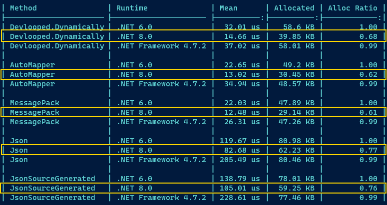

## In-Memory Mapping Benchmarks

Tests the following approaches:

1. Dynamic: creating object (hierarchies) by direct assignment of values from 
   a `dynamic` (anonymous) object using C# DLR dispatch
2. AutoMapper: using the same in-memory (anonymous) object and mapping to a 
   typed model.
3. MessagePack: deserializing from a memory stream (same object structure, but
   from annotated object model)
4. System.Text.Json: deserializing from a memory stream populated by serializing 
   the (anonymous) object using Json.



``` ini

BenchmarkDotNet=v0.13.2, OS=Windows 11 (10.0.22622.575)
Intel Core i9-10900T CPU 1.90GHz, 1 CPU, 20 logical and 10 physical cores
.NET SDK=7.0.100
  [Host]               : .NET 6.0.11 (6.0.1122.52304), X64 RyuJIT AVX2
  .NET 6.0             : .NET 6.0.11 (6.0.1122.52304), X64 RyuJIT AVX2
  .NET 7.0             : .NET 7.0.0 (7.0.22.51805), X64 RyuJIT AVX2
  .NET Framework 4.7.2 : .NET Framework 4.8.1 (4.8.9105.0), X64 RyuJIT VectorSize=256


```
|      Method |                  Job |              Runtime |      Mean |    Error |   StdDev | Ratio |    Gen0 |   Gen1 | Allocated | Alloc Ratio |
|------------ |--------------------- |--------------------- |----------:|---------:|---------:|------:|--------:|-------:|----------:|------------:|
|     Dynamic |             .NET 6.0 |             .NET 6.0 |  20.62 μs | 0.372 μs | 0.290 μs |  0.55 |  3.2043 | 0.0916 |  32.82 KB |        0.87 |
|     Dynamic |             .NET 7.0 |             .NET 7.0 |  20.08 μs | 0.307 μs | 0.257 μs |  0.54 |  3.2043 | 0.0916 |  32.82 KB |        0.87 |
|     Dynamic | .NET Framework 4.7.2 | .NET Framework 4.7.2 |  37.34 μs | 0.320 μs | 0.284 μs |  1.00 |  6.1035 | 0.1831 |  37.63 KB |        1.00 |
|             |                      |                      |           |          |          |       |         |        |           |             |
|  AutoMapper |             .NET 6.0 |             .NET 6.0 |  15.79 μs | 0.284 μs | 0.237 μs |  0.47 |  2.2888 | 0.0610 |  23.41 KB |        0.83 |
|  AutoMapper |             .NET 7.0 |             .NET 7.0 |  15.65 μs | 0.153 μs | 0.143 μs |  0.46 |  2.2888 | 0.0610 |  23.41 KB |        0.83 |
|  AutoMapper | .NET Framework 4.7.2 | .NET Framework 4.7.2 |  33.68 μs | 0.374 μs | 0.350 μs |  1.00 |  4.5776 | 0.1221 |   28.2 KB |        1.00 |
|             |                      |                      |           |          |          |       |         |        |           |             |
| MessagePack |             .NET 6.0 |             .NET 6.0 |  13.91 μs | 0.104 μs | 0.092 μs |  0.59 |  2.1515 | 0.0610 |  22.11 KB |        0.82 |
| MessagePack |             .NET 7.0 |             .NET 7.0 |  13.39 μs | 0.094 μs | 0.088 μs |  0.57 |  2.1515 | 0.0610 |  22.11 KB |        0.82 |
| MessagePack | .NET Framework 4.7.2 | .NET Framework 4.7.2 |  23.46 μs | 0.265 μs | 0.222 μs |  1.00 |  4.3640 | 0.1221 |  26.89 KB |        1.00 |
|             |                      |                      |           |          |          |       |         |        |           |             |
| System Json |             .NET 6.0 |             .NET 6.0 | 122.63 μs | 1.462 μs | 1.368 μs |  0.54 |  6.3477 | 0.7324 |  65.71 KB |        0.93 |
| System Json |             .NET 7.0 |             .NET 7.0 | 117.95 μs | 1.102 μs | 0.977 μs |  0.52 |  6.1035 | 0.6104 |  63.39 KB |        0.90 |
| System Json | .NET Framework 4.7.2 | .NET Framework 4.7.2 | 228.99 μs | 1.725 μs | 1.529 μs |  1.00 | 11.4746 | 0.7324 |  70.63 KB |        1.00 |
